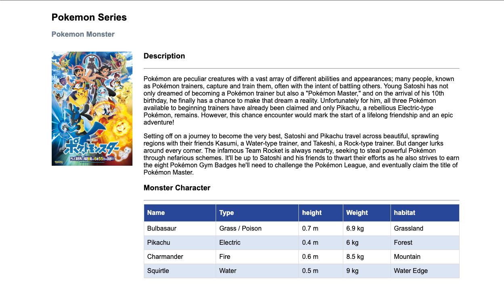

# Pokemon Series Site

## HTML CSS Live Coding

### Implementation technique

Siswa akan melaksanakan sesi live code di 15 menit terakhir dari sesi mentoring dan di awasi secara langsung oleh Mentor. Dengan penjelasan sebagai berikut:

- **Durasi**: 15 menit pengerjaan
- **Submit**: Maximum 10 menit setelah sesi mentoring menggunakan `grader-cli submit`
- **Obligation**: Wajib melakukan _share screen_ di breakout room yang akan dibuatkan oleh Mentor pada saat mengerjakan Live Coding.

### Description

Pada sesi _live coding_ kali ini kalian diminta untuk melengkapi `code` yang sudah diberikan pada _file_ `index.html` (**tidak perlu mengerjakan CSS atau file lain**). Kalian diminta untuk membuat beberapa `element` `html` sebagai berikut:

1. Pada `div` dengan `id` berupa `pokemon-title` buatlah 2 buah `tag` html `h2` dan `p` dengan ketentuan berikut:
    - `h2` : memiliki `id` dengan _value_ `title` dan _value_ `element` berupa `Pokemon Series`.
    - `p` : memiliki `id` dengan _value_ `title-alt` dan _value_ `element` berupa `Pokemon Monster`.
2. Pada `div` dengan `class` berupa `left` buatlah `tag` `html` `img` dengan `src` mengarah pada file `pokemon.jpeg` dalam folder _assets_ dan `alt` dengan _value_ `pokemon-img`.
3. Pada `div` dengan `class` berupa `right` buatlah 2 buah `tag` `html` `section` dengan masing-masing memiliki `id` berupa `synopsis` dan `characters` dengan ketentuan berikut:
    - `synopsis` : merupakan sebuah _section_ yang berisikan _synopsis_ dari series pokemon. _Section_ ini memiliki beberapa _child element_ diantaranya:
        - `h3` : merupakan _element header_ dari _synopsis_ dengan value `Synopsis`.
        - `hr` (_optional_)
        - `p` : merupakan _element paragraph_ dari _synopsis_ dengan _value_ berikut:

            ```txt
            Pokémon are peculiar creatures with a vast array of different abilities and appearances; many people, known as Pokémon trainers, capture and train them, often with the intent of battling others. Young Satoshi has not only dreamed of becoming a Pokémon trainer but also a "Pokémon Master," and on the arrival of his 10th birthday, he finally has a chance to make that dream a reality. Unfortunately for him, all three Pokémon available to beginning trainers have already been claimed and only Pikachu, a rebellious Electric-type Pokémon, remains. However, this chance encounter would mark the start of a lifelong friendship and an epic adventure!

            Setting off on a journey to become the very best, Satoshi and Pikachu travel across beautiful, sprawling regions with their friends Kasumi, a Water-type trainer, and Takeshi, a Rock-type trainer. But danger lurks around every corner. The infamous Team Rocket is always nearby, seeking to steal powerful Pokémon through nefarious schemes. It'll be up to Satoshi and his friends to thwart their efforts as he also strives to earn the eight Pokémon Gym Badges he'll need to challenge the Pokémon League, and eventually claim the title of Pokémon Master.
            ```

    - `characters` : merupakan sebuah _section_ yang berisikan list dari monster pokemon. _Section_ ini memiliki beberapa _child element_ diantaranya:
        - `h3` : merupakan _element header_ dari _card list_ dengan value `Monster Characters`.
        - `hr` (_optional_)
        - `table`: _element table_ untuk menampilkan _list monster_ dari series pokemon yang memiliki `id` dengan _value_ `char-table`.
        Pada bagian _table head_ (`thead`) terdapat `id` dengan _value_ `table-head` dan _table headers_ dengan masing-masing _value_ berupa `name`, `Type`, `Height`, `Weight` dan `Habitat`. Sedangkan pada _table body_ (`tbody`) terdapat `id` dengan _value_ `table-body`. Isi _element_ dari _table body_ akan secara otomatis terisi dari file `main.js`.
        > notes: kalian tidak perlu merubah/menambahkan apapun yang pada file main.js
Berikut pedoman kerangka HTML yang bisa kalian jadikan acuan:

```txt
- body
    - div: pokemon-title
        - h2: title
        - p: title-alt
    -div: pokemon-data
        - div: left
            - image
        - div: right
            - section: synopsis
                - h3
                - hr
                - p
            - section: characters
                - h3
                - hr
                - table: char-table
                    - thead: table-head
                        - tr
                            - th
                    - tbody: table-body
                        -tr
                            - th
```

### Constraints

- Kerjakan hanya pada file **index.html**
- Tidak perlu mengerjakan pada file style.css & main.js
- berikan class/id sesuai yang diminta pada bagian direction diatas.

Berikut dibawah ini contoh hasil yang perlu kalian buat

